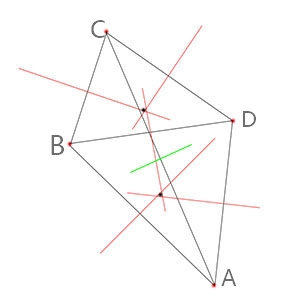

由于要求任意起点，最终观测到同一结果（可以想象一个地球仪，从任意坐标开始观测，但看到的其实是同一个东西的不同角度）
所以生成算法不能从一个随机数不断推演，而要并行的从任意坐标开始推演。但所有坐标推演的结果连在一起要构成合理的模型。

难点在于，没有一个确定的起点，就没法构造递推。传统的地形算法大多都是遵循一定的递归，不断的添加新的差值，推到出结果，
而这里必须做到，对于任意一个点，不经过，或经过有限的简单递归，就要确定一个，相对周围点比较平缓的值，而这些点甚至还未计算。

其实简单的想，要想做到任意坐标起点并行独立演算，结果具有一定合理的约束，那么就不可能每个坐标都对周围产生决定性的影响。
但为了整体效果的合理性，完全随机所有点不合适（可能也不现实），确定一些基本点来保证整体特征是有必要的，
换而言之，可能计算某个点时，为了保证数值的合理，需要寻找一些约束条件，但这些约束条件应该是确定并且有限的。

> 题外：上面的策略其实不完全合理，两个点之间的约束事实上一开始就确定了，两个点的值也就确定了。
> 虽然满足了“随机确定但不用事先计算”，但是确定的时机过早，理想情况下其实应该在需要是再确定，
> 如果这个点一直没访问过那么永远都不应该定死，否则就留下了第三方提前推演窃取这个值的隐患。
> 然而，如果要这么做，就需要在计算每个点时，需要先去“上帝数据库”查询是否已经下达过“判决”，
> 如果没有查找到相关记录，再根据某个这时候才确定的随机种子生成值，并记录这这个随机种子。
> 注意这个“查询->生成->记录”的过程是原子的，防止并发冲突，比如两个点同时进行了观测。
> 这种“观测后才知道”，“知其一必知其二”，“无视两点的局域距离瞬间同步状态”的行为是不是很熟悉？
> 当然说“瞬间同步状态”不准确，由于要防止并发冲突，“同时”对于我们来说不存在，两次观测一定有先后。
> 但是，如果我给模拟世界加入“时间帧”之类概念呢？从帧驱动的游戏内部来看，一帧内的发生就是“同时”。


***
以地球为参考，一些关键参数初值设定：
> 一些拟合算法与验证，请参见doc目录下的 `image` 和 `playground`，
> [numerical.py](./../doc/numerical/numerical.py) 、 [numerical_test.go](./numerical_test.go)

> 请注意这些基本都只是数值特征，并没有特别严格的证明和实际意义

``` Go
// 首先，解决水陆比问题，在(0, 1)的随机范围内取水平面
level = 0.7 // 海洋71%
// 然后，防止碎片化，高地势聚合，高斯拟合
gatherN = 7 // 七大洲
// 考虑到面积多样化，各聚合力不同，对各大洲面积占比拟合
gatherFn = func(x float64) float64 { return 0.3*x*x - 0.5*x + 0.3 }
// 考虑到陆地海拔分布，随机数 (level, 1) 的范围，映射到高度上（单位米）
// 水平面0，总平均海拔850米，最高高度8844米，参照海陆起伏曲线进行幂函数拟合
hightFn = func(x float64) float64 { return 9000 * math.Pow(((x-level)/(1-level)), 3.5) }
// 类似的，考虑到海洋深度分布，随机数 (0, level) 的范围，映射到深度
// 参照海陆起伏曲线，暂且忽略海沟，将平均深度按4000m算，仅拟合线性部分
depthFn = func(x float64) float64 { return 8000 * (x-level)/(level)}
```

***
第一步是根据随机种子与 `gatherN` `gatherFn` ，生成若干 `陆地核` ，包括xyz坐标、聚合力度。
聚合力度实际上决定了陆地的面积范围，距离陆地核越远，聚合力越低，那个地方成为陆地的概率越低。
考虑到陆地的不规则形状，聚合力与距离不能简单的拟合成函数，而要加入在各个不同方向上随机因子。

可以考虑参考扫雷游戏，如果已知一个方格和周围有多少雷，那么可以得到一个不规则的安全方格范围。
注意这里不是先埋雷然后生成数字，而是先有数字，倒推出雷。也就是说不是生成，而是解开一局游戏。

又或者，先“赋予”一些点一个固有的值（就是与坐标相关的一个随机数，任意时刻计算结果确定），
然后根据这个点距离核心的距离确定阈值，越近阈值越低，结合那个固有值判断这个点是陆地还是海洋。

采用第二种。然后，一个点的实际阈值是多个核心作用的叠加，当然如果核心距离较远就可以忽略了。
这样如果两个核心距离很近，中线两端的部分会由于叠加而扩大，可以拟补交叉部分的面积损失。

问题在于，不可能每个点都进行这种判断，而且也要保证海陆划分不能太琐碎。
这要求应该有一些“代表性”的坐标，每一个“统领”一块区域，决定这整个区域是海还是陆。
并且反过来，任意区域里的一个点，我需要能快速定位它所属区域，或者说找到这个区域的决定点。
比较容易想到的是进行球面网格划分，比如类似经纬线那样。但致命的缺陷是不均匀。
我也考虑过多边形密铺，像足球那样，六边形＋五边形是比较常见的，但操作会很复杂。

最后我从[这篇博客](https://zhuanlan.zhihu.com/p/25988652?group_id=828963677192491008)上获得了关键灵感
（具体验证请参见 [sphere.py](./../doc/numerical/sphere.py)）
通过这种算法取样可以保证均匀合理，至于反向定位到关键点，或者更一般的说，查找一个集合中距离某点最近的点：
- 取样点较少并且无规律，那么可以预先记录所有样点，按照某一坐标轴排序，然后从这个坐标轴上最近的点开始查找
- 样本点非常多，但遵循某一（对未来）确定的规律，那么只需计算在目标点一定范围附近的样点，找出关键点

第一种方法，我拿来查找关键点附近的陆地核。第二种方法拿来查找某坐标附近的关键点。
两种方法都涉及一个同样的逻辑：先确定某一坐标轴上距离目标最近的点，从它出发依次查找，
当这个轴上下一个点距离目标的距离已经比目前访问过的点到目标的距离远时，可以停止查找。

~~样本点数量也应该可配置，我将归入 `generator` 作为生成器参数，而不是数值（ `numerical` ）参数。
不同于 `gatherN` 只是指定一个不准确的数值期望，样本点数量是确定的，并且相关的运算不需要数值拟合，
这意味着不需要在 `numerical` 中建立样本点的相关表达式，反过来样本点参数也不会被这些表达式引用。
参照Python原型，样本相关运算最好封装一下，从Go的角度就是样本数量与相关方法的组合，很类似于全局种子 `gene`。~~
麻烦死了，不管了扔到 `numerical` 里面算了。至于相关分装方法的代码，放到 `pointset.go` 里好了。

样本点已经有了，那么我们不妨就根据这些样点，拆出一个个小区块，每个区块简单的当做平面来处理。
根据密铺问题来看，统一用很多全等的小多边形铺满整个表面是不太可能的，圆形又会导致一些点交叉或被忽略。
我尝试用最近的几个样点围成多边形来作为这个平面，但很不幸会遇到两个多边形交叉的情况。
于是尝试统一用样点与周围点中垂线围成的多边形来作为这个平面，经过简单的证明，
虽然边数无法统一，但确实的可以划分成一个个小多边形： [中垂线围成不交叉多边形](./../doc/image/多边形划分.jpg)

>
>> 以A点为例，A的划分多边形SA由AB中垂线ab、AD中垂线ad确定左上部分。
>> 从视觉上看，显然AC中垂线ac不属于SA的边，它看起来位于SA的外面。
>> 严格定义的话，AC中垂点Pac到A的距离大于到BD的距离，所以不属于SA。
>> 反过来，如果某点Pi属于SA，那么它到A的距离肯定小于到其它点的距离。
> 
> 这样，以中垂线为边，中垂线交点为顶点，可以对所有点划分一个属于它的，
> 各自之间不交叉的，全部一起又能紧密贴合铺满球体表面的的空间多边形。

需要注意的是围成的是空间多边形，三点共面一定能找到作为顶点的垂心，但多于三个时垂心本身却不一定共面，
要解决这个问题，一个方案是将多边形投影到平面，扭曲应该也不大；另一个是将多边形本身再划分成多个三角形。
我选择第一个方案，主要原因是，第二个方案虽然操作起来方便，但由于作为顶点的各个垂心实际上不在球体表面，
而是在球体表面上两点连线上（也就是球体内部），会导致多个三角形以一种“多棱锥体”的奇怪形状拼接，
要解决这个问题就需要把所有顶点投影到球体表面，感觉也不比把空间多边形投影到平面多边形方便。
